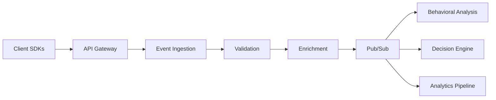
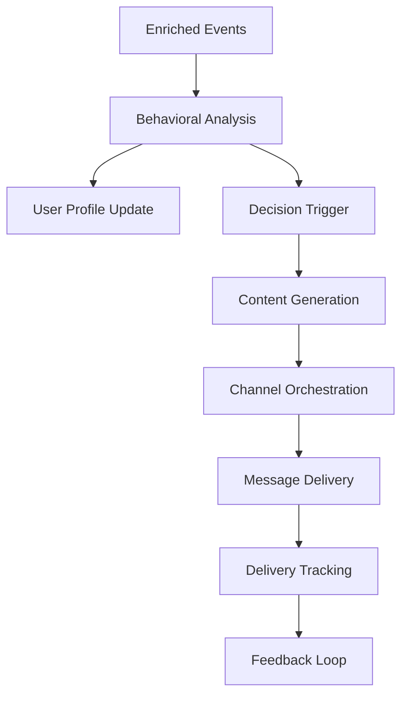
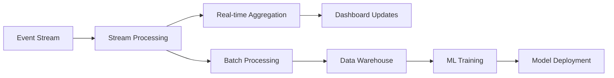

# User Whisperer Platform - System Architecture Overview

## Executive Summary

The User Whisperer Platform is an autonomous AI-powered customer engagement system designed to transform how SaaS applications understand, predict, and influence user behavior. Built on a modern microservices architecture, the platform processes real-time behavioral data to deliver personalized interventions that improve retention, conversion, and overall user satisfaction.

## Core Architecture Principles

### 1. Event-Driven Architecture
- **Asynchronous Processing**: All user interactions are captured as events and processed asynchronously
- **Decoupled Services**: Services communicate via message queues, enabling independent scaling and deployment
- **Event Sourcing**: Complete audit trail of all user interactions for analysis and compliance

### 2. Microservices Design
- **Single Responsibility**: Each service owns a specific business capability
- **Technology Diversity**: Services use optimal technology stacks for their specific requirements
- **Independent Deployment**: Services can be deployed and scaled independently
- **Fault Isolation**: Failures in one service don't cascade to others

### 3. AI-First Approach
- **Machine Learning Pipeline**: Continuous learning from user behavior patterns
- **Real-time Inference**: Sub-100ms decision making for immediate interventions
- **Adaptive Algorithms**: Models that improve automatically based on user feedback
- **Explainable AI**: Transparent decision-making process for compliance and debugging

## System Components

### Client Layer

#### JavaScript SDK
- **Real-time Tracking**: Capture user interactions with <50ms latency
- **Offline Support**: Queue events when connectivity is lost
- **Privacy Controls**: Built-in GDPR compliance and consent management
- **Performance Optimized**: <10KB gzipped, non-blocking integration

#### Python SDK
- **Server-side Tracking**: Batch processing and server-side event generation
- **Async Support**: High-throughput event processing
- **Retry Logic**: Automatic retry with exponential backoff
- **Type Safety**: Full type hints and validation

#### REST/GraphQL APIs
- **RESTful Endpoints**: Standard CRUD operations and batch processing
- **GraphQL Interface**: Flexible querying for dashboard and analytics
- **WebSocket Support**: Real-time subscriptions for live data
- **OpenAPI Specification**: Complete API documentation and client generation

### API Gateway

#### Core Responsibilities
- **Request Routing**: Intelligent routing to appropriate microservices
- **Authentication & Authorization**: JWT-based security with role-based access
- **Rate Limiting**: Tiered rate limiting based on subscription plans
- **Request/Response Transformation**: Protocol translation and data formatting
- **Caching**: Redis-based caching for frequently accessed data

#### Performance Characteristics
- **Throughput**: >50,000 requests/second
- **Latency**: <50ms p95 response time
- **Availability**: 99.95% uptime SLA
- **Security**: WAF protection and DDoS mitigation

### Core Services

#### Event Ingestion Service (Node.js/TypeScript)
- **High-Throughput Processing**: >100,000 events/second
- **Schema Validation**: Real-time validation against evolving schemas
- **Deduplication**: Intelligent duplicate detection and filtering
- **Event Enrichment**: Geographic, device, and behavioral context addition
- **Stream Processing**: Real-time event routing to downstream services

**Technology Stack:**
- Runtime: Node.js 20+ with TypeScript
- Framework: Express.js with custom optimizations
- Validation: AJV with custom schemas
- Monitoring: Prometheus metrics and structured logging

#### Behavioral Analysis Engine (Python)
- **Pattern Recognition**: Advanced ML algorithms for behavior analysis
- **Lifecycle Modeling**: User journey mapping and stage classification
- **Engagement Scoring**: Multi-dimensional engagement calculation
- **Churn Prediction**: Real-time churn risk assessment
- **Cohort Analysis**: Automated cohort generation and tracking

**Technology Stack:**
- Runtime: Python 3.11 with FastAPI
- ML Framework: scikit-learn, XGBoost, TensorFlow
- Data Processing: Pandas, NumPy, Apache Arrow
- Model Serving: MLflow for model management

#### Decision Engine (Python)
- **Real-time Inference**: <100ms decision latency
- **Multi-armed Bandits**: Optimal intervention timing and channel selection
- **A/B Testing**: Automated experiment management and statistical analysis
- **Fatigue Management**: Communication frequency optimization
- **Contextual Recommendations**: Personalized next-best-action suggestions

**Technology Stack:**
- Runtime: Python 3.11 with asyncio
- ML Framework: Thompson Sampling, contextual bandits
- Optimization: SciPy, cvxpy for constraint optimization
- Caching: Redis for model predictions

#### Content Generation Service (Python)
- **LLM Integration**: GPT-4 and Claude for content generation
- **Template Management**: Dynamic template selection and personalization
- **Multi-language Support**: Automatic language detection and translation
- **Compliance Checking**: Automated content review for brand guidelines
- **A/B Testing**: Automatic variant generation and testing

**Technology Stack:**
- Runtime: Python 3.11 with FastAPI
- LLM APIs: OpenAI GPT-4, Anthropic Claude
- NLP: spaCy, NLTK for text processing
- Templates: Jinja2 with custom extensions

#### Channel Orchestration Service (Go)
- **Multi-Channel Delivery**: Email, SMS, push notifications, in-app messages
- **Delivery Optimization**: Provider selection and failover
- **Rate Limiting**: Per-channel and per-user rate limiting
- **Delivery Tracking**: Comprehensive delivery and engagement tracking
- **Template Rendering**: High-performance template processing

**Technology Stack:**
- Runtime: Go 1.21+
- Framework: Gin for HTTP, gRPC for service communication
- Email: SendGrid, AWS SES integration
- SMS: Twilio, AWS SNS integration
- Push: Firebase Cloud Messaging

### Data Layer

#### PostgreSQL (Primary Database)
- **ACID Compliance**: Guaranteed data consistency and durability
- **Advanced Partitioning**: Time-based partitioning for event data
- **Read Replicas**: Horizontal scaling for analytics workloads
- **Connection Pooling**: PgBouncer for connection management
- **Backup Strategy**: Point-in-time recovery with automated backups

**Schema Design:**
- Events: Time-series optimized with JSONB properties
- Users: Normalized user profiles with behavioral metrics
- Campaigns: Campaign configuration and performance tracking
- Decisions: Decision audit trail with full context

#### Redis (Caching & Session Store)
- **High-Performance Caching**: Sub-millisecond response times
- **Session Management**: Distributed session storage
- **Rate Limiting**: Token bucket implementation
- **Pub/Sub**: Real-time event broadcasting
- **Cluster Mode**: High availability with automatic failover

#### BigQuery (Analytics Warehouse)
- **Petabyte Scale**: Unlimited analytics data storage
- **Real-time Streaming**: Sub-second data ingestion
- **Advanced Analytics**: SQL-based data science and ML
- **Cost Optimization**: Partitioning and clustering for query efficiency
- **Data Export**: Easy integration with BI tools

#### S3 (Object Storage)
- **Model Artifacts**: ML model storage and versioning
- **Log Archives**: Long-term log retention
- **Static Assets**: Template assets and media files
- **Backup Storage**: Database and configuration backups

### ML Pipeline

#### Feature Engineering
- **Real-time Features**: Streaming feature computation
- **Batch Features**: Historical aggregations and complex calculations
- **Feature Store**: Centralized feature management and serving
- **Data Quality**: Automated data validation and monitoring
- **Feature Versioning**: A/B testing for feature engineering

#### Model Training
- **Automated Pipelines**: Scheduled retraining based on data drift
- **Experiment Tracking**: MLflow for experiment management
- **Hyperparameter Optimization**: Automated tuning with Optuna
- **Model Validation**: Comprehensive testing before deployment
- **A/B Testing**: Models tested against champion models

#### Online Learning
- **Incremental Updates**: Models that learn from new data continuously
- **Feedback Loops**: User action feedback integrated into training
- **Drift Detection**: Automatic detection of model performance degradation
- **Rapid Deployment**: Hot-swapping of models without downtime

#### Model Serving
- **Low Latency**: <50ms inference time
- **High Throughput**: >10,000 predictions/second per instance
- **Auto-scaling**: Dynamic scaling based on prediction load
- **Model Versioning**: Blue-green deployments for model updates
- **Monitoring**: Comprehensive model performance monitoring

## Data Flow Architecture

### 1. Event Collection

### 2. Real-time Processing

### 3. Analytics Pipeline

## Scalability & Performance

### Horizontal Scaling
- **Stateless Services**: All services designed for horizontal scaling
- **Load Balancing**: Intelligent request distribution
- **Auto-scaling**: Kubernetes HPA based on CPU, memory, and custom metrics
- **Database Sharding**: User-based sharding for massive scale

### Performance Optimizations
- **Connection Pooling**: Efficient database connection management
- **Caching Strategies**: Multi-layer caching from CDN to application level
- **Batch Processing**: Efficient bulk operations where possible
- **Compression**: gRPC and HTTP compression for reduced bandwidth

### Capacity Planning
- **Traffic Patterns**: Predictive scaling based on historical patterns
- **Resource Monitoring**: Comprehensive resource utilization tracking
- **Cost Optimization**: Right-sizing instances and using spot instances
- **Growth Projections**: Quarterly capacity planning reviews

## Security Architecture

### Authentication & Authorization
- **Multi-tenant Security**: Complete data isolation between tenants
- **API Key Management**: Secure key generation, rotation, and revocation
- **JWT Tokens**: Stateless authentication with short-lived tokens
- **Role-based Access**: Granular permissions based on user roles

### Data Protection
- **Encryption at Rest**: AES-256 encryption for all stored data
- **Encryption in Transit**: TLS 1.3 for all network communication
- **PII Anonymization**: Automatic anonymization of sensitive data
- **Data Retention**: Configurable retention policies with automatic deletion

### Compliance
- **GDPR Compliance**: Right to deletion, data portability, consent management
- **SOC 2 Type II**: Annual compliance audits
- **CCPA Compliance**: California consumer privacy rights
- **Industry Standards**: Following OWASP security guidelines

### Monitoring & Incident Response
- **Security Monitoring**: Real-time threat detection and alerting
- **Audit Logging**: Comprehensive audit trail for all operations
- **Incident Response**: Automated incident detection and response playbooks
- **Penetration Testing**: Regular security assessments

## Disaster Recovery & Business Continuity

### High Availability
- **Multi-zone Deployment**: Services deployed across multiple availability zones
- **Database Replication**: Synchronous replication for critical data
- **Load Balancer Failover**: Automatic failover to healthy instances
- **Circuit Breakers**: Automatic failure isolation and recovery

### Backup Strategy
- **Automated Backups**: Daily encrypted backups with point-in-time recovery
- **Cross-region Replication**: Backups replicated to different geographic regions
- **Backup Testing**: Regular backup restoration testing
- **Recovery Time Objective**: <4 hours RTO, <1 hour RPO

### Monitoring & Alerting
- **Comprehensive Monitoring**: Prometheus metrics across all services
- **Real-time Alerting**: PagerDuty integration for critical alerts
- **Dashboard Visualization**: Grafana dashboards for operational visibility
- **SLA Monitoring**: Automated SLA tracking and reporting

## Integration Architecture

### Third-party Integrations
- **Analytics Platforms**: GA4, Mixpanel, Segment bidirectional sync
- **CRM Systems**: Salesforce, HubSpot customer data integration
- **Communication Platforms**: Email, SMS, push notification providers
- **Data Warehouses**: Snowflake, Redshift, BigQuery data export

### API Design
- **RESTful APIs**: Following REST principles with proper HTTP methods
- **GraphQL**: Flexible querying for complex data requirements
- **Webhook Support**: Real-time notifications for external systems
- **SDK Generation**: Automatic SDK generation from OpenAPI specs

### Event Streaming
- **Kafka Integration**: High-throughput event streaming
- **Schema Registry**: Centralized schema management
- **Event Versioning**: Backward-compatible event evolution
- **Dead Letter Queues**: Handling of failed message processing

## Deployment Architecture

### Containerization
- **Docker Containers**: All services containerized for consistency
- **Multi-stage Builds**: Optimized container images
- **Security Scanning**: Automated vulnerability scanning
- **Registry Management**: Private container registry with image signing

### Orchestration
- **Kubernetes**: Container orchestration with auto-scaling
- **Helm Charts**: Templated deployment configurations
- **GitOps**: Git-based deployment automation with ArgoCD
- **Blue-Green Deployments**: Zero-downtime deployments

### Infrastructure as Code
- **Terraform**: Infrastructure provisioning and management
- **Version Control**: All infrastructure changes tracked in Git
- **Environment Parity**: Consistent environments across dev/staging/prod
- **Cost Management**: Automated cost tracking and optimization

## Future Architecture Evolution

### Planned Enhancements
- **Edge Computing**: CDN-based edge processing for global latency reduction
- **Serverless Migration**: Function-based computing for variable workloads
- **Advanced ML**: Deep learning models for more sophisticated predictions
- **Real-time Streaming**: Apache Kafka for ultra-low latency processing

### Scalability Roadmap
- **Global Deployment**: Multi-region deployment for compliance and performance
- **Advanced Caching**: Distributed caching with Redis clusters
- **Database Optimization**: Advanced partitioning and indexing strategies
- **ML at Scale**: Distributed training and inference infrastructure

This architecture provides a robust, scalable, and secure foundation for the User Whisperer Platform, enabling autonomous customer engagement at massive scale while maintaining high performance and reliability standards.
