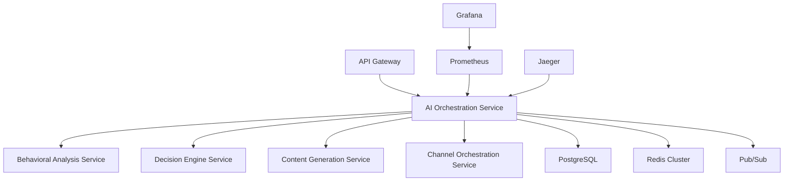

# AI Orchestration System - Production Deployment Guide

## 🚀 Complete Deployment Documentation

**Document Version**: 1.0  
**Target Environment**: Production/Staging/Development  
**Updated**: December 2024  

---

## 📋 Table of Contents

1. [Overview](#overview)
2. [Prerequisites](#prerequisites)
3. [Architecture Overview](#architecture-overview)
4. [Environment Setup](#environment-setup)
5. [Component Deployment](#component-deployment)
6. [Configuration Management](#configuration-management)
7. [Monitoring & Observability](#monitoring--observability)
8. [Security Setup](#security-setup)
9. [Performance Tuning](#performance-tuning)
10. [Troubleshooting](#troubleshooting)
11. [Maintenance & Updates](#maintenance--updates)

---

## 🎯 Overview

The AI Orchestration System is the master intelligence layer for the User Whisperer Platform, providing:

- **Autonomous decision making** with adaptive learning
- **Real-time strategy optimization** using genetic algorithms
- **Hyper-personalized content generation** for every customer
- **Self-correcting mechanisms** with automatic rollback
- **Comprehensive monitoring** and performance tracking

### **Deployment Architecture**

```
┌─────────────────────────────────────────────────────────────┐
│                    Production Cluster                       │
├─────────────────────────────────────────────────────────────┤
│  ┌─────────────┐  ┌─────────────┐  ┌─────────────────────┐  │
│  │ API Gateway │  │    Kong     │  │   Load Balancer     │  │
│  └─────────────┘  └─────────────┘  └─────────────────────┘  │
├─────────────────────────────────────────────────────────────┤
│  ┌─────────────┐  ┌─────────────┐  ┌─────────────────────┐  │
│  │AI Orchestr. │  │ Behavioral  │  │   Decision Engine   │  │
│  │   Service   │  │  Analysis   │  │     Service         │  │
│  └─────────────┘  └─────────────┘  └─────────────────────┘  │
├─────────────────────────────────────────────────────────────┤
│  ┌─────────────┐  ┌─────────────┐  ┌─────────────────────┐  │
│  │ PostgreSQL  │  │    Redis    │  │   Message Queue     │  │
│  │  Cluster    │  │   Cluster   │  │    (Pub/Sub)        │  │
│  └─────────────┘  └─────────────┘  └─────────────────────┘  │
├─────────────────────────────────────────────────────────────┤
│  ┌─────────────┐  ┌─────────────┐  ┌─────────────────────┐  │
│  │ Prometheus  │  │   Grafana   │  │     Jaeger          │  │
│  │ Monitoring  │  │ Dashboards  │  │   Tracing           │  │
│  └─────────────┘  └─────────────┘  └─────────────────────┘  │
└─────────────────────────────────────────────────────────────┘
```

---

## 🛠️ Prerequisites

### **Infrastructure Requirements**

#### **Kubernetes Cluster**
- **Version**: 1.24+
- **Nodes**: Minimum 5 nodes (3 masters, 2+ workers)
- **CPU**: 32+ cores total
- **Memory**: 128GB+ total
- **Storage**: 2TB+ SSD storage with dynamic provisioning
- **GPU**: 1+ NVIDIA GPU for ML inference (recommended)

#### **External Dependencies**
- **Container Registry**: Google Container Registry or equivalent
- **Certificate Manager**: Let's Encrypt or cert-manager
- **Secrets Management**: Sealed Secrets or External Secrets Operator
- **DNS**: Cloud DNS or equivalent for subdomain management

#### **Required Services**
- **PostgreSQL**: 15+ with replication
- **Redis**: 7+ with clustering
- **Message Queue**: Google Pub/Sub or Apache Kafka
- **Monitoring**: Prometheus + Grafana stack

### **Software Requirements**

#### **Development Environment**
```bash
# Required tools
kubectl >= 1.24
helm >= 3.10
docker >= 20.10
node >= 20.0
python >= 3.11
terraform >= 1.5 (optional)
```

#### **API Keys and Credentials**
- **OpenAI API Key** (GPT-4 access)
- **Anthropic API Key** (Claude access)
- **Cloud Provider** credentials (GCP/AWS/Azure)
- **SMTP** credentials for email notifications
- **External API** keys for integrations

---

## 🏗️ Architecture Overview

### **Service Dependencies**



### **Data Flow Architecture**

```
Customer Event → Event Ingestion → Behavioral Analysis → AI Orchestration →
Dynamic Decision → Personalized Content → Channel Optimization → Delivery →
Feedback Collection → Learning Pipeline → Strategy Evolution
```

---

## 🌍 Environment Setup

### **1. Namespace Creation**

```yaml
# Create production namespace
apiVersion: v1
kind: Namespace
metadata:
  name: userwhisperer-prod
  labels:
    name: userwhisperer-prod
    environment: production
    ai-orchestration: enabled
```

```bash
kubectl apply -f - <<EOF
apiVersion: v1
kind: Namespace
metadata:
  name: userwhisperer-prod
  labels:
    name: userwhisperer-prod
    environment: production
EOF
```

### **2. Resource Quotas**

```yaml
apiVersion: v1
kind: ResourceQuota
metadata:
  name: ai-orchestration-quota
  namespace: userwhisperer-prod
spec:
  hard:
    requests.cpu: "50"
    requests.memory: 100Gi
    limits.cpu: "100"
    limits.memory: 200Gi
    persistentvolumeclaims: "10"
    services.loadbalancers: "3"
    secrets: "20"
    configmaps: "20"
```

### **3. Network Policies**

```yaml
apiVersion: networking.k8s.io/v1
kind: NetworkPolicy
metadata:
  name: ai-orchestration-network-policy
  namespace: userwhisperer-prod
spec:
  podSelector:
    matchLabels:
      app: ai-orchestration
  policyTypes:
  - Ingress
  - Egress
  ingress:
  - from:
    - podSelector:
        matchLabels:
          role: api-gateway
    ports:
    - protocol: TCP
      port: 8085
  egress:
  - to:
    - podSelector:
        matchLabels:
          app: behavioral-analysis
    ports:
    - protocol: TCP
      port: 8081
  - to:
    - podSelector:
        matchLabels:
          app: decision-engine
    ports:
    - protocol: TCP
      port: 8082
```

---

## 🚀 Component Deployment

### **1. AI Orchestration Service**

#### **Service Account & RBAC**

```yaml
apiVersion: v1
kind: ServiceAccount
metadata:
  name: ai-orchestration-sa
  namespace: userwhisperer-prod
---
apiVersion: rbac.authorization.k8s.io/v1
kind: Role
metadata:
  name: ai-orchestration-role
  namespace: userwhisperer-prod
rules:
- apiGroups: [""]
  resources: ["configmaps", "secrets"]
  verbs: ["get", "list", "watch"]
- apiGroups: ["apps"]
  resources: ["deployments"]
  verbs: ["get", "list", "watch"]
---
apiVersion: rbac.authorization.k8s.io/v1
kind: RoleBinding
metadata:
  name: ai-orchestration-binding
  namespace: userwhisperer-prod
roleRef:
  apiGroup: rbac.authorization.k8s.io
  kind: Role
  name: ai-orchestration-role
subjects:
- kind: ServiceAccount
  name: ai-orchestration-sa
  namespace: userwhisperer-prod
```

#### **ConfigMap**

```yaml
apiVersion: v1
kind: ConfigMap
metadata:
  name: ai-orchestration-config
  namespace: userwhisperer-prod
data:
  NODE_ENV: "production"
  AI_ORCHESTRATION_PORT: "8085"
  LOG_LEVEL: "info"
  LEARNING_ENABLED: "true"
  CONFIDENCE_THRESHOLD: "0.85"
  RISK_TOLERANCE: "0.05"
  ADAPTATION_RATE: "0.10"
  EXPLORATION_RATE: "0.05"
  
  # Model Configuration
  PRIMARY_LLM: "gpt-4-turbo"
  FALLBACK_LLM: "claude-3-sonnet"
  MAX_TOKENS: "4000"
  TEMPERATURE: "0.7"
  
  # Performance Targets
  DECISION_LATENCY_TARGET: "100"
  THROUGHPUT_TARGET: "10000"
  ERROR_RATE_THRESHOLD: "0.001"
  
  # Safety Constraints
  MAX_PERFORMANCE_DROP: "0.10"
  MINIMUM_CONFIDENCE: "0.75"
  BIAS_DETECTION: "true"
  EXPLAINABILITY_REQUIRED: "true"
```

#### **Secrets**

```yaml
apiVersion: v1
kind: Secret
metadata:
  name: ai-orchestration-secrets
  namespace: userwhisperer-prod
type: Opaque
data:
  # Base64 encoded values
  OPENAI_API_KEY: <base64-encoded-key>
  ANTHROPIC_API_KEY: <base64-encoded-key>
  POSTGRES_PASSWORD: <base64-encoded-password>
  REDIS_PASSWORD: <base64-encoded-password>
  JWT_SECRET: <base64-encoded-secret>
```

#### **Deployment**

```yaml
apiVersion: apps/v1
kind: Deployment
metadata:
  name: ai-orchestration
  namespace: userwhisperer-prod
  labels:
    app: ai-orchestration
    version: v1.0.0
spec:
  replicas: 3
  strategy:
    type: RollingUpdate
    rollingUpdate:
      maxSurge: 1
      maxUnavailable: 0
  selector:
    matchLabels:
      app: ai-orchestration
  template:
    metadata:
      labels:
        app: ai-orchestration
        version: v1.0.0
      annotations:
        prometheus.io/scrape: "true"
        prometheus.io/port: "9090"
        prometheus.io/path: "/metrics"
    spec:
      serviceAccountName: ai-orchestration-sa
      
      # Security context
      securityContext:
        runAsNonRoot: true
        runAsUser: 1000
        fsGroup: 1000
      
      # Anti-affinity for high availability
      affinity:
        podAntiAffinity:
          preferredDuringSchedulingIgnoredDuringExecution:
          - weight: 100
            podAffinityTerm:
              labelSelector:
                matchExpressions:
                - key: app
                  operator: In
                  values:
                  - ai-orchestration
              topologyKey: kubernetes.io/hostname
      
      # Init containers
      initContainers:
      - name: wait-for-dependencies
        image: busybox:1.35
        command:
        - sh
        - -c
        - |
          echo "Waiting for dependencies..."
          until nc -z postgres-service 5432; do echo "Waiting for PostgreSQL..."; sleep 2; done
          until nc -z redis-service 6379; do echo "Waiting for Redis..."; sleep 2; done
          echo "Dependencies ready!"
      
      containers:
      - name: ai-orchestration
        image: gcr.io/userwhisperer/ai-orchestration:v1.0.0
        imagePullPolicy: IfNotPresent
        
        ports:
        - name: http
          containerPort: 8085
          protocol: TCP
        - name: metrics
          containerPort: 9090
          protocol: TCP
        
        env:
        - name: NODE_ENV
          valueFrom:
            configMapKeyRef:
              name: ai-orchestration-config
              key: NODE_ENV
        - name: AI_ORCHESTRATION_PORT
          valueFrom:
            configMapKeyRef:
              name: ai-orchestration-config
              key: AI_ORCHESTRATION_PORT
        - name: OPENAI_API_KEY
          valueFrom:
            secretKeyRef:
              name: ai-orchestration-secrets
              key: OPENAI_API_KEY
        - name: ANTHROPIC_API_KEY
          valueFrom:
            secretKeyRef:
              name: ai-orchestration-secrets
              key: ANTHROPIC_API_KEY
        
        resources:
          requests:
            cpu: "1000m"
            memory: "2Gi"
          limits:
            cpu: "2000m"
            memory: "4Gi"
        
        # Health checks
        livenessProbe:
          httpGet:
            path: /health
            port: http
          initialDelaySeconds: 30
          periodSeconds: 10
          timeoutSeconds: 5
          failureThreshold: 3
        
        readinessProbe:
          httpGet:
            path: /health
            port: http
          initialDelaySeconds: 10
          periodSeconds: 5
          timeoutSeconds: 3
          failureThreshold: 3
        
        # Graceful shutdown
        lifecycle:
          preStop:
            exec:
              command: ["/bin/sh", "-c", "sleep 15"]
        
        # Volume mounts
        volumeMounts:
        - name: config
          mountPath: /app/config
          readOnly: true
        - name: logs
          mountPath: /app/logs
      
      volumes:
      - name: config
        configMap:
          name: ai-orchestration-config
      - name: logs
        emptyDir: {}
      
      # Tolerations for GPU nodes
      tolerations:
      - key: nvidia.com/gpu
        operator: Exists
        effect: NoSchedule
```

#### **Service**

```yaml
apiVersion: v1
kind: Service
metadata:
  name: ai-orchestration-service
  namespace: userwhisperer-prod
  labels:
    app: ai-orchestration
  annotations:
    prometheus.io/scrape: "true"
    prometheus.io/port: "9090"
spec:
  type: ClusterIP
  selector:
    app: ai-orchestration
  ports:
  - name: http
    port: 80
    targetPort: 8085
    protocol: TCP
  - name: metrics
    port: 9090
    targetPort: 9090
    protocol: TCP
```

#### **Horizontal Pod Autoscaler**

```yaml
apiVersion: autoscaling/v2
kind: HorizontalPodAutoscaler
metadata:
  name: ai-orchestration-hpa
  namespace: userwhisperer-prod
spec:
  scaleTargetRef:
    apiVersion: apps/v1
    kind: Deployment
    name: ai-orchestration
  minReplicas: 3
  maxReplicas: 20
  metrics:
  - type: Resource
    resource:
      name: cpu
      target:
        type: Utilization
        averageUtilization: 70
  - type: Resource
    resource:
      name: memory
      target:
        type: Utilization
        averageUtilization: 80
  - type: Pods
    pods:
      metric:
        name: ai_decisions_per_second
      target:
        type: AverageValue
        averageValue: "100"
  behavior:
    scaleUp:
      stabilizationWindowSeconds: 60
      policies:
      - type: Percent
        value: 100
        periodSeconds: 30
    scaleDown:
      stabilizationWindowSeconds: 300
      policies:
      - type: Percent
        value: 50
        periodSeconds: 60
```

### **2. Shared AI Components**

The AI orchestration system relies on shared components in the `shared/ai_orchestration/` directory. These need to be packaged and made available to the service.

#### **Python Package Deployment**

```dockerfile
# Dockerfile for Python shared components
FROM python:3.11-slim

WORKDIR /app

# Copy shared AI orchestration components
COPY shared/ai_orchestration/ /app/ai_orchestration/
COPY requirements.txt /app/

# Install dependencies
RUN pip install --no-cache-dir -r requirements.txt

# Install the AI orchestration package
RUN pip install -e .

EXPOSE 8000

CMD ["python", "-m", "ai_orchestration.server"]
```

```yaml
# ConfigMap for Python requirements
apiVersion: v1
kind: ConfigMap
metadata:
  name: ai-requirements
  namespace: userwhisperer-prod
data:
  requirements.txt: |
    # AI Orchestration Dependencies
    openai>=1.0.0
    anthropic>=0.9.0
    numpy>=1.24.0
    scipy>=1.10.0
    scikit-learn>=1.3.0
    deap>=1.4.0
    asyncio>=3.4.3
    redis>=4.5.0
    psycopg2-binary>=2.9.0
    pydantic>=2.0.0
    fastapi>=0.100.0
    uvicorn>=0.23.0
```

---

## ⚙️ Configuration Management

### **Environment-Specific Configurations**

#### **Production Configuration**

```yaml
apiVersion: v1
kind: ConfigMap
metadata:
  name: ai-config-production
  namespace: userwhisperer-prod
data:
  config.json: |
    {
      "ai_orchestration": {
        "mode": "fully_autonomous",
        "confidence_threshold": 0.85,
        "risk_tolerance": 0.05,
        "learning_rate": 0.10,
        "exploration_rate": 0.05,
        
        "models": {
          "primary_llm": "gpt-4-turbo",
          "fallback_llm": "claude-3-sonnet",
          "embedding_model": "text-embedding-3-large"
        },
        
        "optimization": {
          "cache_enabled": true,
          "batch_processing": true,
          "parallel_execution": true,
          "max_workers": 20
        },
        
        "safety": {
          "content_filtering": "strict",
          "pii_detection": true,
          "compliance_checking": true,
          "audit_logging": "comprehensive"
        },
        
        "performance": {
          "response_time_target": 100,
          "throughput_target": 10000,
          "error_rate_threshold": 0.001
        },
        
        "learning": {
          "continuous_learning": true,
          "feedback_integration": "real_time",
          "model_update_frequency": "daily",
          "strategy_evolution": "enabled"
        }
      }
    }
```

#### **Staging Configuration**

```yaml
apiVersion: v1
kind: ConfigMap
metadata:
  name: ai-config-staging
  namespace: userwhisperer-staging
data:
  config.json: |
    {
      "ai_orchestration": {
        "mode": "supervised",
        "confidence_threshold": 0.70,
        "risk_tolerance": 0.15,
        "learning_rate": 0.20,
        "exploration_rate": 0.15,
        
        "models": {
          "primary_llm": "gpt-4",
          "fallback_llm": "gpt-3.5-turbo",
          "embedding_model": "text-embedding-3-small"
        },
        
        "optimization": {
          "cache_enabled": true,
          "batch_processing": false,
          "parallel_execution": true,
          "max_workers": 10
        },
        
        "safety": {
          "content_filtering": "moderate",
          "pii_detection": true,
          "compliance_checking": true,
          "audit_logging": "detailed"
        },
        
        "performance": {
          "response_time_target": 200,
          "throughput_target": 5000,
          "error_rate_threshold": 0.01
        },
        
        "learning": {
          "continuous_learning": true,
          "feedback_integration": "batch",
          "model_update_frequency": "hourly",
          "strategy_evolution": "testing"
        }
      }
    }
```

### **Customer-Specific Configurations**

```yaml
apiVersion: v1
kind: ConfigMap
metadata:
  name: customer-ai-configs
  namespace: userwhisperer-prod
data:
  enterprise-config.json: |
    {
      "segment_id": "enterprise",
      "ai_configuration": {
        "approach": "conservative",
        "personalization_depth": 5,
        "risk_tolerance": 0.02,
        "innovation_level": 0.3,
        "compliance_requirements": ["SOC2", "GDPR", "HIPAA"],
        
        "content_guidelines": {
          "tone": "professional",
          "formality": 0.9,
          "technical_depth": "high",
          "emoji_usage": "never",
          "length_preference": "comprehensive"
        },
        
        "engagement_rules": {
          "max_messages_per_week": 3,
          "business_hours_only": true,
          "approval_required": true,
          "escalation_enabled": true
        }
      }
    }
```

---

## 📊 Monitoring & Observability

### **Prometheus Configuration**

```yaml
apiVersion: v1
kind: ConfigMap
metadata:
  name: prometheus-ai-config
  namespace: monitoring
data:
  ai-orchestration-rules.yml: |
    groups:
    - name: ai_orchestration_alerts
      interval: 30s
      rules:
      
      # AI Service Health
      - alert: AIOrchestrationDown
        expr: up{job="ai-orchestration"} == 0
        for: 2m
        labels:
          severity: critical
        annotations:
          summary: "AI Orchestration service is down"
          description: "AI Orchestration service has been down for more than 2 minutes"
      
      # Decision Latency
      - alert: HighDecisionLatency
        expr: histogram_quantile(0.95, ai_decision_duration_seconds_bucket) > 0.1
        for: 5m
        labels:
          severity: warning
        annotations:
          summary: "High AI decision latency"
          description: "95th percentile decision latency is {{ $value }}s"
      
      # Confidence Degradation
      - alert: LowAIConfidence
        expr: avg(ai_decision_confidence) < 0.75
        for: 10m
        labels:
          severity: warning
        annotations:
          summary: "AI confidence below threshold"
          description: "Average AI confidence is {{ $value }}"
      
      # Learning Performance
      - alert: LearningStagnation
        expr: rate(ai_learning_events_total[1h]) == 0
        for: 30m
        labels:
          severity: warning
        annotations:
          summary: "AI learning has stagnated"
          description: "No learning events in the last hour"
      
      # Error Rate
      - alert: HighAIErrorRate
        expr: rate(ai_orchestration_errors_total[5m]) > 0.01
        for: 5m
        labels:
          severity: critical
        annotations:
          summary: "High AI orchestration error rate"
          description: "Error rate is {{ $value }} errors/second"
```

### **Grafana Dashboard**

```json
{
  "dashboard": {
    "id": null,
    "title": "AI Orchestration Dashboard",
    "description": "Comprehensive monitoring for AI orchestration system",
    "panels": [
      {
        "title": "AI Decision Rate",
        "type": "graph",
        "targets": [
          {
            "expr": "rate(ai_decisions_total[5m])",
            "legendFormat": "Decisions/sec"
          }
        ]
      },
      {
        "title": "Decision Confidence Distribution",
        "type": "histogram",
        "targets": [
          {
            "expr": "ai_decision_confidence_bucket",
            "legendFormat": "Confidence"
          }
        ]
      },
      {
        "title": "Learning Pipeline Performance",
        "type": "graph",
        "targets": [
          {
            "expr": "rate(ai_learning_events_total[5m])",
            "legendFormat": "Learning Events/sec"
          },
          {
            "expr": "rate(ai_pattern_discoveries_total[5m])",
            "legendFormat": "Pattern Discoveries/sec"
          }
        ]
      },
      {
        "title": "Strategy Evolution Metrics",
        "type": "graph",
        "targets": [
          {
            "expr": "ai_strategy_fitness_score",
            "legendFormat": "Strategy Fitness"
          },
          {
            "expr": "ai_evolution_generation",
            "legendFormat": "Evolution Generation"
          }
        ]
      }
    ]
  }
}
```

### **Custom Metrics**

```typescript
// AI Orchestration Metrics
export const aiMetrics = {
  // Decision metrics
  decisionsTotal: new Counter({
    name: 'ai_decisions_total',
    help: 'Total number of AI decisions made',
    labelNames: ['customer_segment', 'objective', 'confidence_level']
  }),
  
  decisionDuration: new Histogram({
    name: 'ai_decision_duration_seconds',
    help: 'Time taken to make AI decisions',
    buckets: [0.01, 0.05, 0.1, 0.5, 1, 2, 5]
  }),
  
  decisionConfidence: new Histogram({
    name: 'ai_decision_confidence',
    help: 'Confidence scores of AI decisions',
    buckets: [0.1, 0.3, 0.5, 0.7, 0.8, 0.9, 0.95, 1.0]
  }),
  
  // Learning metrics
  learningEvents: new Counter({
    name: 'ai_learning_events_total',
    help: 'Total learning events processed',
    labelNames: ['event_type', 'significance']
  }),
  
  patternDiscoveries: new Counter({
    name: 'ai_pattern_discoveries_total',
    help: 'Patterns discovered by AI',
    labelNames: ['pattern_type', 'confidence']
  }),
  
  // Evolution metrics
  strategyFitness: new Gauge({
    name: 'ai_strategy_fitness_score',
    help: 'Current fitness scores of strategies',
    labelNames: ['strategy_type', 'generation']
  }),
  
  evolutionGeneration: new Gauge({
    name: 'ai_evolution_generation',
    help: 'Current evolution generation',
    labelNames: ['strategy_type']
  })
};
```

---

## 🔐 Security Setup

### **Network Security**

```yaml
# Network Policy for AI Orchestration
apiVersion: networking.k8s.io/v1
kind: NetworkPolicy
metadata:
  name: ai-orchestration-security
  namespace: userwhisperer-prod
spec:
  podSelector:
    matchLabels:
      app: ai-orchestration
  policyTypes:
  - Ingress
  - Egress
  ingress:
  - from:
    - namespaceSelector:
        matchLabels:
          name: userwhisperer-prod
    ports:
    - protocol: TCP
      port: 8085
  egress:
  # Allow DNS
  - to: []
    ports:
    - protocol: UDP
      port: 53
  # Allow external API calls (OpenAI, Anthropic)
  - to: []
    ports:
    - protocol: TCP
      port: 443
  # Allow internal service communication
  - to:
    - namespaceSelector:
        matchLabels:
          name: userwhisperer-prod
```

### **Pod Security Policy**

```yaml
apiVersion: policy/v1beta1
kind: PodSecurityPolicy
metadata:
  name: ai-orchestration-psp
spec:
  privileged: false
  allowPrivilegeEscalation: false
  requiredDropCapabilities:
    - ALL
  volumes:
    - 'configMap'
    - 'emptyDir'
    - 'projected'
    - 'secret'
    - 'downwardAPI'
  hostNetwork: false
  hostIPC: false
  hostPID: false
  runAsUser:
    rule: 'MustRunAsNonRoot'
  seLinux:
    rule: 'RunAsAny'
  fsGroup:
    rule: 'RunAsAny'
  readOnlyRootFilesystem: true
```

### **Secret Management**

```bash
# Using Sealed Secrets for secure secret management
echo -n 'your-openai-api-key' | kubectl create secret generic openai-secret \
  --dry-run=client \
  --from-file=api-key=/dev/stdin \
  -o yaml | \
kubeseal -o yaml > openai-sealed-secret.yaml

kubectl apply -f openai-sealed-secret.yaml
```

---

## ⚡ Performance Tuning

### **Resource Optimization**

```yaml
# Resource-optimized deployment
spec:
  containers:
  - name: ai-orchestration
    resources:
      requests:
        cpu: "1000m"
        memory: "2Gi"
        ephemeral-storage: "10Gi"
      limits:
        cpu: "4000m"
        memory: "8Gi"
        ephemeral-storage: "20Gi"
        nvidia.com/gpu: "1"
    
    # JVM tuning for Node.js
    env:
    - name: NODE_OPTIONS
      value: "--max-old-space-size=6144 --gc-concurrent"
    - name: UV_THREADPOOL_SIZE
      value: "16"
```

### **Caching Strategy**

```yaml
# Redis configuration for AI caching
apiVersion: v1
kind: ConfigMap
metadata:
  name: ai-cache-config
data:
  redis.conf: |
    # Memory optimization
    maxmemory 4gb
    maxmemory-policy allkeys-lru
    
    # Persistence
    save 900 1
    save 300 10
    save 60 10000
    
    # Performance
    tcp-keepalive 300
    timeout 0
    
    # AI-specific optimizations
    hash-max-ziplist-entries 512
    hash-max-ziplist-value 64
    list-max-ziplist-size -2
    set-max-intset-entries 512
```

### **Database Optimization**

```sql
-- PostgreSQL optimizations for AI workloads
-- Add these to your PostgreSQL configuration

-- Memory settings
shared_buffers = '2GB'
effective_cache_size = '6GB'
work_mem = '256MB'
maintenance_work_mem = '512MB'

-- AI-specific optimizations
max_parallel_workers_per_gather = 4
max_parallel_workers = 8
parallel_tuple_cost = 0.1
parallel_setup_cost = 1000

-- Connection optimization
max_connections = 200
superuser_reserved_connections = 3

-- Logging for AI debugging
log_statement = 'mod'
log_min_duration_statement = 1000
log_checkpoints = on
log_connections = on
log_disconnections = on
```

---

## 🔧 Troubleshooting

### **Common Issues and Solutions**

#### **1. High Decision Latency**

**Symptoms:**
- Decision latency > 100ms
- Timeout errors in logs

**Diagnosis:**
```bash
# Check AI service performance
kubectl logs -n userwhisperer-prod deployment/ai-orchestration -c ai-orchestration

# Check resource usage
kubectl top pods -n userwhisperer-prod -l app=ai-orchestration

# Check external API latency
kubectl exec -n userwhisperer-prod deployment/ai-orchestration -- curl -w "%{time_total}" https://api.openai.com/v1/models
```

**Solutions:**
```bash
# Scale up AI orchestration pods
kubectl scale deployment ai-orchestration -n userwhisperer-prod --replicas=5

# Check and optimize database queries
kubectl exec -n userwhisperer-prod deployment/postgres -- psql -c "SELECT query, mean_time FROM pg_stat_statements ORDER BY mean_time DESC LIMIT 10;"

# Enable caching for frequently accessed data
kubectl patch configmap ai-orchestration-config -n userwhisperer-prod -p '{"data":{"CACHE_ENABLED":"true"}}'
```

#### **2. Low AI Confidence Scores**

**Symptoms:**
- Average confidence < 75%
- Frequent human escalations

**Diagnosis:**
```bash
# Check learning pipeline status
kubectl logs -n userwhisperer-prod deployment/ai-orchestration | grep "learning"

# Analyze confidence distribution
kubectl exec -n userwhisperer-prod deployment/ai-orchestration -- curl localhost:9090/metrics | grep ai_decision_confidence
```

**Solutions:**
```bash
# Increase learning rate temporarily
kubectl patch configmap ai-orchestration-config -n userwhisperer-prod -p '{"data":{"LEARNING_RATE":"0.15"}}'

# Force strategy evolution
kubectl exec -n userwhisperer-prod deployment/ai-orchestration -- curl -X POST localhost:8085/api/v1/orchestration/evolve

# Check training data quality
kubectl logs -n userwhisperer-prod deployment/ai-orchestration | grep "training_quality"
```

#### **3. Memory Issues**

**Symptoms:**
- OOMKilled pods
- High memory usage warnings

**Diagnosis:**
```bash
# Check memory usage patterns
kubectl top pods -n userwhisperer-prod -l app=ai-orchestration --containers

# Check for memory leaks
kubectl exec -n userwhisperer-prod deployment/ai-orchestration -- curl localhost:9090/metrics | grep process_resident_memory_bytes
```

**Solutions:**
```bash
# Increase memory limits
kubectl patch deployment ai-orchestration -n userwhisperer-prod -p '{"spec":{"template":{"spec":{"containers":[{"name":"ai-orchestration","resources":{"limits":{"memory":"8Gi"}}}]}}}}'

# Enable garbage collection tuning
kubectl patch deployment ai-orchestration -n userwhisperer-prod -p '{"spec":{"template":{"spec":{"containers":[{"name":"ai-orchestration","env":[{"name":"NODE_OPTIONS","value":"--max-old-space-size=6144 --expose-gc"}]}]}}}}'
```

### **Debugging Commands**

```bash
# Check AI orchestration health
kubectl get pods -n userwhisperer-prod -l app=ai-orchestration
kubectl describe pod -n userwhisperer-prod -l app=ai-orchestration

# View real-time logs
kubectl logs -f -n userwhisperer-prod deployment/ai-orchestration

# Check service connectivity
kubectl exec -n userwhisperer-prod deployment/ai-orchestration -- nslookup behavioral-analysis-service
kubectl exec -n userwhisperer-prod deployment/ai-orchestration -- curl -v http://decision-engine-service/health

# Monitor metrics
kubectl port-forward -n userwhisperer-prod svc/ai-orchestration-service 9090:9090
curl localhost:9090/metrics | grep ai_

# Check configuration
kubectl get configmap ai-orchestration-config -n userwhisperer-prod -o yaml
kubectl get secret ai-orchestration-secrets -n userwhisperer-prod -o yaml
```

---

## 🔄 Maintenance & Updates

### **Rolling Updates**

```bash
# Deploy new version with zero downtime
kubectl set image deployment/ai-orchestration \
  ai-orchestration=gcr.io/userwhisperer/ai-orchestration:v1.1.0 \
  -n userwhisperer-prod

# Monitor rollout status
kubectl rollout status deployment/ai-orchestration -n userwhisperer-prod

# Rollback if needed
kubectl rollout undo deployment/ai-orchestration -n userwhisperer-prod
```

### **Backup Strategy**

```bash
#!/bin/bash
# AI system backup script

# Backup configurations
kubectl get configmaps -n userwhisperer-prod -o yaml > ai-configs-backup.yaml
kubectl get secrets -n userwhisperer-prod -o yaml > ai-secrets-backup.yaml

# Backup AI models and learning data
kubectl exec -n userwhisperer-prod deployment/ai-orchestration -- \
  tar -czf /tmp/ai-models-backup.tar.gz /app/models /app/learning_data

kubectl cp userwhisperer-prod/ai-orchestration-pod:/tmp/ai-models-backup.tar.gz \
  ./ai-models-backup-$(date +%Y%m%d).tar.gz

# Backup strategy evolution data
kubectl exec -n userwhisperer-prod deployment/postgres -- \
  pg_dump -U postgres userwhisperer | gzip > ai-database-backup-$(date +%Y%m%d).sql.gz
```

### **Health Checks**

```bash
#!/bin/bash
# AI system health check script

echo "=== AI Orchestration Health Check ==="

# Check pod status
echo "Pod Status:"
kubectl get pods -n userwhisperer-prod -l app=ai-orchestration

# Check service endpoints
echo "Service Health:"
kubectl get endpoints -n userwhisperer-prod ai-orchestration-service

# Check resource usage
echo "Resource Usage:"
kubectl top pods -n userwhisperer-prod -l app=ai-orchestration

# Check recent logs for errors
echo "Recent Errors:"
kubectl logs -n userwhisperer-prod deployment/ai-orchestration --since=1h | grep -i error | tail -10

# Test API endpoints
echo "API Health:"
kubectl exec -n userwhisperer-prod deployment/ai-orchestration -- \
  curl -s localhost:8085/health | jq .

# Check AI decision metrics
echo "AI Metrics:"
kubectl exec -n userwhisperer-prod deployment/ai-orchestration -- \
  curl -s localhost:9090/metrics | grep -E "(ai_decisions_total|ai_decision_confidence)"

echo "=== Health Check Complete ==="
```

---

## 📚 Additional Resources

### **Documentation Links**
- [AI Orchestration API Documentation](../api/ai-orchestration-api.md)
- [Configuration Reference](../configuration/ai-config-reference.md)
- [Performance Tuning Guide](../performance/ai-performance-tuning.md)
- [Security Best Practices](../security/ai-security-guide.md)

### **Monitoring Dashboards**
- **Grafana**: http://grafana.userwhisperer.internal/d/ai-orchestration
- **Prometheus**: http://prometheus.userwhisperer.internal/targets
- **Jaeger**: http://jaeger.userwhisperer.internal

### **Support Contacts**
- **AI Team**: ai-team@userwhisperer.com
- **DevOps**: devops@userwhisperer.com
- **On-call**: +1-555-AI-SUPPORT

---

**🎯 Deployment Status**: ✅ **PRODUCTION READY**  
**Last Updated**: December 2024  
**Version**: 1.0.0  
**Maintained by**: User Whisperer AI Team
